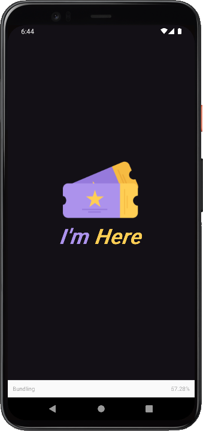

<h1 align="center">I'm Here
	<br/>
	
	<br/>
</h1>

[](https://github.com/LeoMSSilva)
[](https://github.com/LeoMSSilva)
[](#)
[](https://github.com/LeoMSSilva/imhere/stargazers)
[](https://github.com/LeoMSSilva/imhere/network/members)
[](https://github.com/LeoMSSilva/imhere/graphs/contributors)

---

# :pushpin: Table of Contents

- :house: [About](#house-about)
- :dart: [Installation](#dart-installation)
  - :gear: [Install dependencies](#hammer_and_wrench-install-dependencies)
  - :rocket: [Getting started](#rocket-getting-started)
- :computer: [Techs](#computer-techs)
- :bust_in_silhouette: [Author](#bust_in_silhouette-author)
- :handshake: [Contributing](#handshake-contributing)
- :scroll: [License](#scroll-license)

---

# :house: About

This project was developed in **typescript** language, using **react native** and **expo** frameworks.

I used **javascript** and **json** languages ​​as secondary languages, just for the configuration files.

I used the **commitlint**, **@commitlint/config-conventional**, **commitizen** and **cz-conventional-changelog** libraries to keep the patterns in the commits, the **prettier**, **@trivago/prettier-plugin-sort-imports** and **eslint** (*config*: **prettier**, **@react-native-community**; *plugins*: **prettier**, **@typescript-eslint**, **@react-native-community**; *parser*: **@typescript-eslint**) libraries to maintain formatting standards, also helping to remove errors in the code, and the **husky**, **lint-staged** libraries to automate tasks before committing new code to ensure that the code is formatted and without errors.

I used the **babel plugin module resolver** library to define relative paths.

This project is about a list of attendees for an event.

You can access the project through the qr code published at **[expo](https://expo.dev/@leomssilva/imhere)**.

---

# :dart: Installation

**First you need to install:**

- [Node.js](https://pt-br.nodejs.org/) (required)
- [Yarn](https://yarnpkg.com/) (optional)
- [Expo](https://expo.io/) (required)

  **Then in order, clone the project.**

By HTTPS, running this command:

```bash
  git clone https://github.com/LeoMSSilva/imhere.git
```

Or by ssh, running this command:

```bash
  git clone git@github.com:LeoMSSilva/imhere.git
```

SSH is a secure protocol, but you need to register a key ssh in your github before.

## :hammer_and_wrench: Install dependencies

```bash
  yarn
```

or

```bash
  yarn install
```

## :rocket: Getting Started

```bash
  yarn start
```

---

# :computer: Techs

- Babel plugin module resolver
- Commitlint 
  - @commitlint/config-conventional
- Commitizen 
  - cz-conventional-changelog
- Eslint
  - config: 
    - prettier
    - @react-native-community
  - plugins: 
    - prettier
    - @typescript-eslint
    - @react-native-community
  - parser: 
    - @typescript-eslint
- Expo
- Expo status bar
- Javascript
- Husky
- Lint-staged
- Prettier 
  - @trivago/prettier-plugin-sort-imports
- React
- React native
- Typescript

---

# :bust_in_silhouette: Author

**LeoMSSilva**

- Github: [@LeoMSSilva](https://github.com/LeoMSSilva)
- LinkedIn: [@LeoMSSilva](https://linkedin.com/in/LeoMSSilva)

---

# :handshake: Contributing

Contributions, issues and feature requests are welcome! Feel free to **file a new issue** on the [imhere](https://github.com/LeoMSSilva/imhere/issues) repository. If you already found a solution to your problem, **I would love to review your pull request**!

---

# :scroll: License

Copyright :copyright: 2022 [LeoMSSilva](https://github.com/LeoMSSilva).
<br/>
This project is [MIT](https://github.com/LeoMSSilva/imhere/blob/main/LICENSE) licensed.

---
